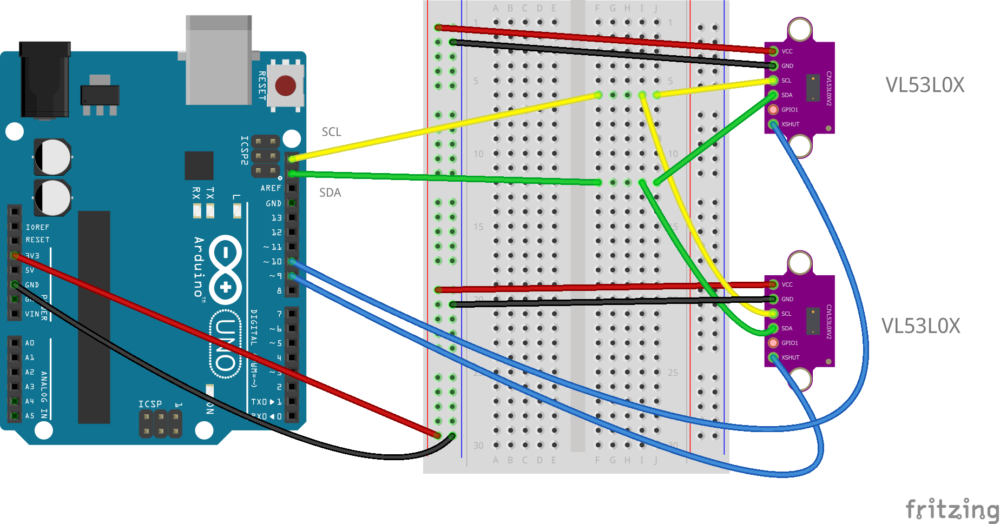

# AweareHaptics

   

De nos jours, on compte parmis la population française plus de 207 000 aveugles et plus d’1 million de personnes souffrant de cécité visuelle. De plus, d’après l’OMS, le nombre de malvoyants pourrait trippler d’ici 2050. Actuellement, les outils d’aide développés pour ces personnes sont peu avancés technologiquement et nécessite souvent d’important coût d’achat. Nous avons donc décidé de développer un outil d’aide à l’orientation dans l’espace accessible à tous pour les personnes aveugles et malvoyantes.

**Aweare Haptics est une veste haptique open source permettant aux personnes aveugles et malvoyantes de s’orienter dans leur environnement.**

# Pour commencer

Entrez ici les instructions pour bien débuter avec votre projet...

### Pré-requis

Ce qu'il est requis pour commencer avec votre projet du point de vue du matériel

- Imprimante 3D
- Poste de soudure
- Poste de couture

# Démarrage

Notre veste sera composée de capteurs infrarouge pour détecter la présence d’obstacle et de movuino pour transmettre l’information aux actuateurs présent sur la veste. L’emplacement des vibreurs a été déterminés par la réalisation d’une cartographie de sensibilité.

#  Partie moteurs actuateurs

## Matériel

Pour chaque moteur vous aurez besoin de :

- faire faire un pcb néomotor : le fichier brd est dans le repo
- résistance 10Ω boitier 0805 : lien vers la [référence fabriquant : CRCW080510R0FKEA](https://fr.rs-online.com/web/p/resistances-cms/6790825/)
- résistance 100Ω boitier 0805 : lien vers la [référence fabriquant : CR0805-FX-1000ELF](https://fr.rs-online.com/web/p/resistances-cms/7408978/)
- résistance 442Ω boitier 0805 : lien vers la [référence fabriquant : ERA6AEB4420V](https://fr.rs-online.com/web/p/resistances-cms/7086023/)
- résistance 4KΩ boitier 0805 : lien vers la [référence fabriquant : CRCW08054K02FKEA](https://fr.rs-online.com/web/p/resistances-cms/6791471/)
- Condensateur type 104 : 10nF, boitier 0805 : lien vers la [référence fabriquant : CC0805KRX7R9BB103](https://fr.rs-online.com/web/p/condensateurs-ceramique-multicouches/4614013/)
- transitor npn simple boitier SOT-32 : lien vers la [référence fabriquant : MMBT3904LT1G](https://fr.rs-online.com/web/p/transistors-bipolaires-bjt/5450343/)
- moteur vibrant [Type Model NFP-P0716](https://nfpshop.com/product/7mm-vibration-motor-16mm-type-model-nfp-p0716-3v-12000rpm-7-3g-amplitude)

## Fabrication du pcb

vous aurez besoin de commander ou bien de fabriquer des PCB, pour bien faire fonctionner les moteurs vibrant

## Montage

AJOUTER SCHEMA

## Branchements
 - brancher le GND de la movuino sur le GND du pcb
 - brancher le +5V de la movuino sur le +5V du pcb
 - brancher le +3V de la movuino sur le +3V du pcb
 - brancher la pin D9 de la movuino sur le DIN du pcb
 - brancher les deux fils sur moteur sur le bornes moteur du pcb. (le moteur n'est pas polarisé)

brancher ensuite :
 - le GND du pcb sur le GND du pcb suivant
 - le +5V de pcb sur le +5V du pcb suivant
 - le +3V de pcb sur le +3V du pcb suivant
 - la pin D9 de pcb sur le DIN du pcb suivant

## Code 

téléverser le code source sur la movuino

la carte moovuino devient un serveur socket sur l'adresse 192.168.4.2
1 client max peut s'y connecter : ce nombre est modifiable dans le fichier ... : le define BN_CLIENT // TODO : dire ne nom du fichier  

le serveur ne fait que recevoir des messages des clients. le message doit etre formaté un string cntenant le numéo de l'actuateur à faire vibrer, ainsi qu'une intensité ayant une valeur comprise entre 0 et 3 

## Souder les PCBd

## Monter..

#  Partie capteurs infrarouge

## Matériel

- Plaque de prototypage : lien vers la [référence fabriquant : 743635] https://fr.rs-online.com/web/p/cartes-matrices/4853892/
- Capteur infrarouge VL53L0X TECNOIOT (mesure jusqu'à 2m) : lien vers la [référence fabriquant : A513-VL53L0X-297-5PCS ]
https://www.amazon.fr/TECNOIOT-VL53L0X-Flight-Distance-GY-VL53L0XV2/dp/B084BTP479/ref=sr_1_6?__mk_fr_FR=%C3%85M%C3%85%C5%BD%C3%95%C3%91&crid=6Q645XXPDDA7&dchild=1&keywords=lidar+arduino&qid=1606946373&sprefix=lidar+%2Caps%2C326&sr=8-6
- Capteur infrarouge VL53L1X STMicroelectronics (mesure jusqu'à 4m): lien vers la [référence fabriquant : VL53L1X-SATEL] https://fr.rs-online.com/web/p/modules-de-developpement-pour-capteurs/1827794/?cm_mmc=FR-PPC-DS3A-_-bing-_-3_FR_FR_Modules+de+d%C3%A9veloppement+pour+capteurs_STMicroelectronics_Exact-_-STMicroelectronics+-+Modules+de+d%C3%A9veloppement+pour+capteurs+-+1827794-_-vl53l1x+satel&matchtype=e&kwd-71743717917902:loc-66&gclid=534000e661d01b55fc8760f1bc5fa77a&gclsrc=3p.ds&msclkid=534000e661d01b55fc8760f1bc5fa77a

## Elaboration de la plaque de prototypage 

METTRE PHOTO DE LA PLAQUE

faire une ligne 5V, une ligne GND, une ligne SCL et une ligne SDA

## Montage

Schema des pins du VL53L1X :

## Branchements

 - brancher le GND de la movuino sur une ligne de la plaque 
 - brancher le +3V de la movuino sur une ligne de la plaque 
 - brancher la pin SCL de la movuino sur une ligne de la plaque
 - brancher la pin SDA de la movuino sur une ligne de la plaque

brancher ensuite pour chaque capteurs :

 - brancher la pin GND du capteur a la ligne GND de la plaque
 - brancher la pin VIN/VDD du capteur a la ligne 3V de la plaque
 - brancher la pin SCL du capteur a la ligne SCL de la plaque
 - brancher la pin SDA du capteur a la ligne SDA de la plaque
 - brancher la pin D3, D4, D5... de la movuino sur le XSHUT des capteurs VL53L0X ou XSDN pour les capteurs VL53L1X.

## Code 

# Auteurs

* [**Guicharnaud Léo**](https://github.com/Lightman31)
* [**Buot Adrien** ](https://github.com/Bubu781 )
* [**terre Mikhali** ](https://github.com/Mikhali)
* [**Sabatey Clara** ](https://github.com/clarasbty)
* [**Noiraux Coline** ](https://github.com/NoireauxColine)
* [**Beurotte Marine** ](https://github.com/mama98)

## Versions 
Liste des versions : [**Cliquer pour afficher les tags**](https://github.com/AweareHaptics/AweareHaptics/tags)

## Fabriqué avec

- [Arduino](https://www.arduino.cc/) - IDE
- [VScode](https://code.visualstudio.com/) + [PlatformIO](https://platformio.org/) - éditeur de texte et IDE
- [Fusion360](https://www.autodesk.fr/products/fusion-360/overview) - logiciel de modélisation 3D 
- [Eagle](https://www.autodesk.fr/products/eagle/overview) - logiciel de conception électronique

## License
Ce projet est sous licence ``exemple: WTFTPL`` - voir le fichier [LICENSE.md](LICENSE.md) pour plus d'informations

