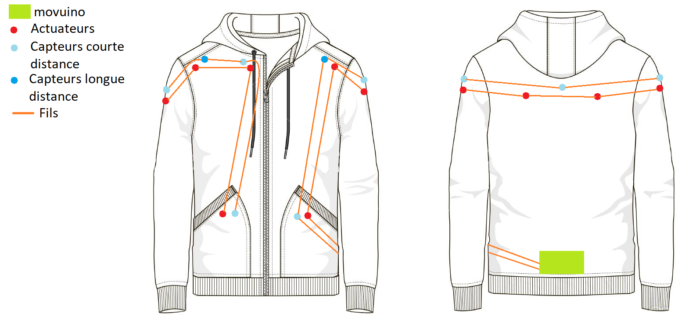
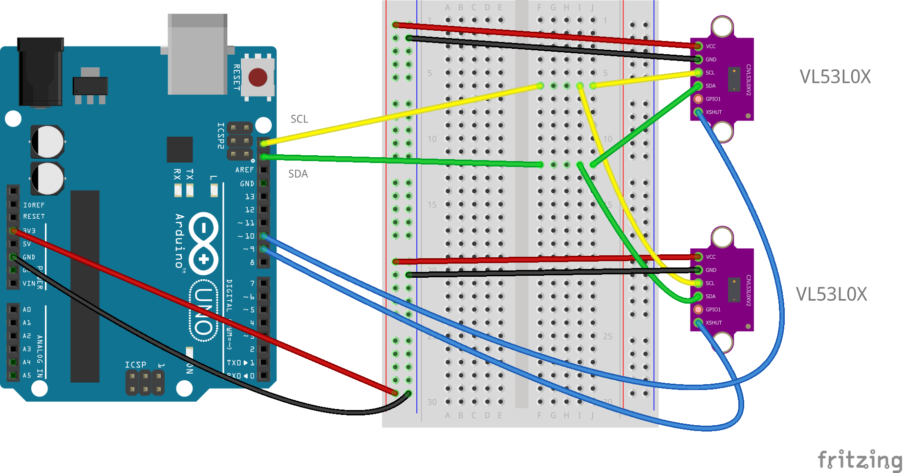
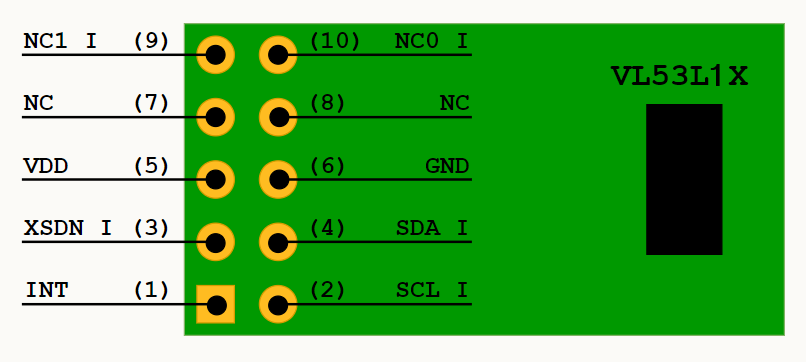

# AweareHaptics

Nowadays, the french population amounts more than 207 000 blind people and more than a million people suffer from visual defficiencies. According to the OMS, the number of visually impaired people should triple by 2050. Currently, the support tools developed and available for these people are not technologically advanced and often require significant purchase costs. We therefore decided to develop a tool to help with spatial orientation, accessible to all, for the blind or visually impaired.

**Aweare Haptics is an open source project on the development of a haptic vest allowing the blind or visually impaired to orient themselves in their surrounding environment.**

Aweare Haptics is a student project in partnership with the CRI.

This readme is a comprehensive guide on how to use the Git so you can build the vest for yourself. It also contains explainations on our choices so you can adapt it for yourself.

### Requirements

List of hardware required to get started with your project:

- 3D printer
- Soldering station
- Sewing station

# Synopsis

The haptic vest is composed of infrared sensors to detect obstacles, 2 movuinos to transfer instructions to the motor actuators sewn to the vest. The location of the vibrators was determined by performing a sensitivity mapping. 

# Brief

The vest will be entirely made by you. This guide will give you the different components we used to make our own vest. If at any point in the process of building it, you think that something we made isn't adapted for you, don't hesitate to customize it. This repository is mostly a guideline to help you along the way. We will explain our thought process so you can better understand our choices.

The Vest in itself is made in 2 separate parts. Each part is controlled by one movuino board. The first one is the motor control. 

# Architecture of this repository

This repository is divided into multiple folders :

## 3D Model

In this folder you will find two other folders. They include the 3D model that we use to make the vest :

- "Holders" contains the ones used to support the sensors in the vest

- "Caps" contains the ones used to encapsulate the vibration motor.

## Code 

This folder is composed of two folders :
- "Motors" contains the code to upload to the movuino that operates the motors
- "Sensors" contains the code to upload to the movuino that operates the sensors

The code manages the wifi connection. The motor part takes care of setting up the server whereas the sensors represent the hotspot/client.

#  Motor Actuators

## Required hardware

For every motor used you'll need the following components:
- Néomotor PCB: you can find our brd file in the repository
- SMD resistor 10Ω type 0805 : link to [manufacturer reference : CRCW080510R0FKEA](https://fr.rs-online.com/web/p/resistances-cms/6790825/)
- SMD resistor 100Ω type 0805 : link to [manufacturer reference : CR0805-FX-1000ELF](https://fr.rs-online.com/web/p/resistances-cms/7408978/)
- SMD resistor 442Ω type 0805 : link to [manufacturer reference : ERA6AEB4420V](https://fr.rs-online.com/web/p/resistances-cms/7086023/)
- SMD resistor 4KΩ type 0805 : link to [manufacturer reference : CRCW08054K02FKEA](https://fr.rs-online.com/web/p/resistances-cms/6791471/)
- Capacitor type 104 : 10nF, SMD type 0805 :  link to  [manufacturer reference : CC0805KRX7R9BB103](https://fr.rs-online.com/web/p/condensateurs-ceramique-multicouches/4614013/)
- Transitor npn SOT-32 :  link to  [manufacturer reference : MMBT3904LT1G](https://fr.rs-online.com/web/p/transistors-bipolaires-bjt/5450343/)
- Vibration Motor [Type Model NFP-P0716](https://nfpshop.com/product/7mm-vibration-motor-16mm-type-model-nfp-p0716-3v-12000rpm-7-3g-amplitude)

## Setting up the PCB

You'll need to order or make your own PCB with the brd file found on this repository to make the motors work.

## Mounting/Assembly

## Wiring
 - Connect the GND pin of the movuino to the IN GND pin of the pcb
 - Connect the +5V pin of the movuino to the IN +5V pin of the pcb
 - Connect the +3V pin of the movuino to the IN +3V pin of the pcb
 - Connect the D9 pin of the movuino to the IN DIN pin of the pcb
 - Connect the two motor wires to the motor labeled pins on the pcb (in whatever order as the motor isn't polarized)

Then connect :
 - The OUT GND of the first pcb to the following pcb on its IN GND pin
 - The OUT +5V of the first pcb to the following pcb on its IN +5V pin
 - The OUT +3V of the first pcb to the following pcb on its IN +3V pin
 - The DOUT pin of the first pcb to the DIN of the following pcb 

## Code 

Upload the source code to the movuino

The movuino card becomes a sever socket on the address 192.168.4.2
A maximum of one client can connect at a time : this can be changed in the file : ... define BN_CLIENT // TODO ADD NAME OF FILE

The server receives messages from the clients. The messages need to be formated in strings containing the id of the vibration motor that we want to pilot along with its intensity whose value ranges from 0 to 3

## Solder the PCB

## Mounting

# Infrared Sensors

## Required hardware

- Prototyping plate : link to [manufacturer reference  : 743635] https://fr.rs-online.com/web/p/cartes-matrices/4853892/
- Infrared sensor VL53L0X TECNOIOT (measures up to 2 meters) : link to [manufacturer reference : A513-VL53L0X-297-5PCS ]
https://www.amazon.fr/TECNOIOT-VL53L0X-Flight-Distance-GY-VL53L0XV2/dp/B084BTP479/ref=sr_1_6?__mk_fr_FR=%C3%85M%C3%85%C5%BD%C3%95%C3%91&crid=6Q645XXPDDA7&dchild=1&keywords=lidar+arduino&qid=1606946373&sprefix=lidar+%2Caps%2C326&sr=8-6
- Infrared sensor VL53L1X STMicroelectronics (measures up to 4 meters): link to [manufacturer reference : VL53L1X-SATEL] https://fr.rs-online.com/web/p/modules-de-developpement-pour-capteurs/1827794/?cm_mmc=FR-PPC-DS3A-_-bing-_-3_FR_FR_Modules+de+d%C3%A9veloppement+pour+capteurs_STMicroelectronics_Exact-_-STMicroelectronics+-+Modules+de+d%C3%A9veloppement+pour+capteurs+-+1827794-_-vl53l1x+satel&matchtype=e&kwd-71743717917902:loc-66&gclid=534000e661d01b55fc8760f1bc5fa77a&gclsrc=3p.ds&msclkid=534000e661d01b55fc8760f1bc5fa77a

## Setting up the prototyping plate

Solder a line for 5V, a line for GND, a line for SCL and a line for SDA.

## Mouting/Assembly

Schematics for the VL53L1X corresponding pins :

## Wiring

 - Connect the GND pin of the movuino to any line on the prototyping plate which becomes its designated line. (GND)
 - Connect the +3V pin of the movuino to any line on the prototyping plate which becomes its designated line. (+3V)
 - Connect the SCL pin of the movuino to any line on the prototyping plate which becomes its designated line. (SCL)
 - Connect the SDA pin of the movuino to any line on the prototyping plate which becomes its designated line. (SDA)

Connect then for every sensor:

 - Connect the GND pin of the sensor to the designated GND line on the prototyping plate
 - Connect the VIN/VDD pin of the sensor to the designated +3V line on the prototyping plate
 - Connect the SCL pin of the sensor to the designated SCL line on the prototyping plate
 - Connect the SDA pin of the sensor to the designated SDA line on the prototyping plate
 - Connect the pins D3, D4, D5... of the movuino to the XSHUT pin for the sensor VL53L0X or XSDN pin for the VL53L1X sensor.

## Code 

# Sensibility protocole

Sensibility mapping process:

Before getting started with the mapping, you'll need to prepare your work environment.
You'll need to carry out the protocole by using the body proportions of the person wearing the vest.
You'll need to use a vibration motor connected to a power source of 3.3V to map out the sensitive areas of the person's body.

## First step : Divide into squares the person's body

We'll seperate the torso, the back and the arms into different testing areas.

 -On the torso : seperate in 10 different areas
 --Area 1 and 2 : Upper left and right part of the torso 
 --Area 3 and 4 : left and right part of the chest
 --Area 5 and 6 : left and right part of the ribs under the chest area
 --Area 7 and 8 : left and right part of the belly
 --Area 9 and 10 : left and right part of the hips

 -On the back : seperate in 8 different areas.
 --Area 1 and 2 : left and right part of the shoulder blades
 --Area 3 and 4 : left and right part of the ribs under the shoulder blades
 --Area 5 and 6 : left and right part of lower back (lumbar region)
 --Area 7 and 8 : left and right part of hips

 -On the arms : seperate in 4 different areas
 --Area 1 : right shoulder
 --Area 2 : right arm 
 --Area 3 : left shoulder
 --Area 4 : left arm 

## Second step : Mapping out the sensitive areas

- Start by powering up the motor with a voltage of 3.3V.
WARNING : In order for the mapping to be correct, the motor needs to be supplied with a constant voltage of 3.3V for the duration of the tests.

-In order to familiarize yourself with the feeling of the vibrating motor, try out every area at least once before ruling out the ones that are too sensitive.

-Position the motor on every testing area and define one of the following feedback:
--Extremely sensitive area : red
--Sensitive area : orange
--Not very sensitive area : yellow
--Not recommended area (private regions or no sensitivity) : white

-We recommend repeating the protocole multiple times for better results.

# Authors

* [**Guicharnaud Léo**](https://github.com/Lightman31)
* [**Buot Adrien** ](https://github.com/Bubu781 )
* [**terre Mikhali** ](https://github.com/Mikhali)
* [**Sabatey Clara** ](https://github.com/clarasbty)
* [**Noiraux Coline** ](https://github.com/NoireauxColine)
* [**Beurotte Marine** ](https://github.com/mama98)

# Version Francaise :

De nos jours, on compte parmis la population française plus de 207 000 aveugles et plus d’1 million de personnes souffrant de cécité visuelle. De plus, d’après l’OMS, le nombre de malvoyants pourrait trippler d’ici 2050. Actuellement, les outils d’aide développés pour ces personnes sont peu avancés technologiquement et nécessite souvent d’important coût d’achat. Nous avons donc décidé de développer un outil d’aide à l’orientation dans l’espace accessible à tous pour les personnes aveugles et malvoyantes.

**Aweare Haptics est une veste haptique open source permettant aux personnes aveugles et malvoyantes de s’orienter dans leur environnement.**

# Pour commencer

Entrez ici les instructions pour bien débuter avec votre projet...

### Pré-requis

Ce qu'il est requis pour commencer avec votre projet du point de vue du matériel

- Imprimante 3D
- Poste de soudure
- Poste de couture

# Démarrage

Notre veste sera composée de capteurs infrarouge pour détecter la présence d’obstacle et de movuino pour transmettre l’information aux actuateurs présent sur la veste. L’emplacement des vibreurs a été déterminés par la réalisation d’une cartographie de sensibilité.

#  Partie moteurs actuateurs

## Matériel

Pour chaque moteur vous aurez besoin de :

- faire faire un pcb néomotor : le fichier brd est dans le repo
- résistance 10Ω boitier 0805 : lien vers la [référence fabriquant : CRCW080510R0FKEA](https://fr.rs-online.com/web/p/resistances-cms/6790825/)
- résistance 100Ω boitier 0805 : lien vers la [référence fabriquant : CR0805-FX-1000ELF](https://fr.rs-online.com/web/p/resistances-cms/7408978/)
- résistance 442Ω boitier 0805 : lien vers la [référence fabriquant : ERA6AEB4420V](https://fr.rs-online.com/web/p/resistances-cms/7086023/)
- résistance 4KΩ boitier 0805 : lien vers la [référence fabriquant : CRCW08054K02FKEA](https://fr.rs-online.com/web/p/resistances-cms/6791471/)
- Condensateur type 104 : 10nF, boitier 0805 : lien vers la [référence fabriquant : CC0805KRX7R9BB103](https://fr.rs-online.com/web/p/condensateurs-ceramique-multicouches/4614013/)
- transitor npn simple boitier SOT-32 : lien vers la [référence fabriquant : MMBT3904LT1G](https://fr.rs-online.com/web/p/transistors-bipolaires-bjt/5450343/)
- moteur vibrant [Type Model NFP-P0716](https://nfpshop.com/product/7mm-vibration-motor-16mm-type-model-nfp-p0716-3v-12000rpm-7-3g-amplitude)

## Fabrication du pcb

vous aurez besoin de commander ou bien de fabriquer des PCB, pour bien faire fonctionner les moteurs vibrant

## Montage

AJOUTER SCHEMA

## Branchements
 - brancher le GND de la movuino sur le GND du pcb
 - brancher le +5V de la movuino sur le +5V du pcb
 - brancher le +3V de la movuino sur le +3V du pcb
 - brancher la pin D9 de la movuino sur le DIN du pcb
 - brancher les deux fils sur moteur sur le bornes moteur du pcb. (le moteur n'est pas polarisé)

brancher ensuite :
 - le GND du pcb sur le GND du pcb suivant
 - le +5V de pcb sur le +5V du pcb suivant
 - le +3V de pcb sur le +3V du pcb suivant
 - la pin D9 de pcb sur le DIN du pcb suivant

## Code 

téléverser le code source sur la movuino

la carte movuino devient un serveur socket sur l'adresse 192.168.4.2
1 client max peut s'y connecter : ce nombre est modifiable dans le fichier ... : le define BN_CLIENT // TODO : dire le nom du fichier  

le serveur ne fait que recevoir des messages des clients. le message doit etre formaté un string cntenant le numéo de l'actuateur à faire vibrer, ainsi qu'une intensité ayant une valeur comprise entre 0 et 3 

## Souder les PCBd

## Monter..

#  Partie capteurs infrarouge

## Matériel

- Plaque de prototypage : lien vers la [référence fabriquant : 743635] https://fr.rs-online.com/web/p/cartes-matrices/4853892/
- Capteur infrarouge VL53L0X TECNOIOT (mesure jusqu'à 2m) : lien vers la [référence fabriquant : A513-VL53L0X-297-5PCS ]
https://www.amazon.fr/TECNOIOT-VL53L0X-Flight-Distance-GY-VL53L0XV2/dp/B084BTP479/ref=sr_1_6?__mk_fr_FR=%C3%85M%C3%85%C5%BD%C3%95%C3%91&crid=6Q645XXPDDA7&dchild=1&keywords=lidar+arduino&qid=1606946373&sprefix=lidar+%2Caps%2C326&sr=8-6
- Capteur infrarouge VL53L1X STMicroelectronics (mesure jusqu'à 4m): lien vers la [référence fabriquant : VL53L1X-SATEL] https://fr.rs-online.com/web/p/modules-de-developpement-pour-capteurs/1827794/?cm_mmc=FR-PPC-DS3A-_-bing-_-3_FR_FR_Modules+de+d%C3%A9veloppement+pour+capteurs_STMicroelectronics_Exact-_-STMicroelectronics+-+Modules+de+d%C3%A9veloppement+pour+capteurs+-+1827794-_-vl53l1x+satel&matchtype=e&kwd-71743717917902:loc-66&gclid=534000e661d01b55fc8760f1bc5fa77a&gclsrc=3p.ds&msclkid=534000e661d01b55fc8760f1bc5fa77a

## Elaboration de la plaque de prototypage 

METTRE PHOTO DE LA PLAQUE

faire une ligne 5V, une ligne GND, une ligne SCL et une ligne SDA

## Montage

Schema des pins du VL53L1X :

## Branchements

 - brancher le GND de la movuino sur une ligne de la plaque 
 - brancher le +3V de la movuino sur une ligne de la plaque 
 - brancher la pin SCL de la movuino sur une ligne de la plaque
 - brancher la pin SDA de la movuino sur une ligne de la plaque

brancher ensuite pour chaque capteurs :

 - brancher la pin GND du capteur a la ligne GND de la plaque
 - brancher la pin VIN/VDD du capteur a la ligne 3V de la plaque
 - brancher la pin SCL du capteur a la ligne SCL de la plaque
 - brancher la pin SDA du capteur a la ligne SDA de la plaque
 - brancher la pin D3, D4, D5... de la movuino sur le XSHUT des capteurs VL53L0X ou XSDN pour les capteurs VL53L1X.

## Code 

# Protocole de sensibilité

Processus de réalisation de la cartographie:

Avant de commencer la cartographie, il faut préparer l'environnement de travail.
Ce protocole est à réaliser sur le corps de la personne qui portera la veste.
Pour réaliser ce protocole, il faut se munir d'un moteur vibrant branché à une puissance de 3,3V.

## Première étape : Qadriller le corps de la personne 

Nous allons séparer le buste, le dos et les bras en différentes zones à tester.

-Sur le devant du corps : séparer en 10 zones.
--Zone 1 et 2 : Haut du buste partie droite et partie gauche
--Zone 3 et 4 : Poitrine partie droite et partie gauche
--Zone 5 et 6 : Cotes sous poitrine partie droite et partie gauche
--Zone 7 et 8 : Ventre partie droite et partie gauche
--Zone 9 et 10 : Hanches partie droite et partie gauche

-Sur le derrière du corps : séparer en 8 zones.
--Zone 1 et 2 : Omoplates partie droite et partie gauche
--Zone 3 et 4 : Cotes sous omoplates partie droite et partie gauche
--Zone 5 et 6 : Bas du dos (zone lombaire) partie droite et partie gauche
--Zone 7 et 8 : Hanches partie droite et partie gauche

-Sur les bras : séparer en 4 zones 
--Zone 1 : bras droit épaule
--Zone 2 : bras droit haut du bras
--Zone 3 : bras gauche épaule
--Zone 4 : bras gauche haut du bras

## Deuxième étape : Elaboration de la cartographie

-Commencer par allumer le moteur avec une puissance de fonctionnement de 3,3V.
ATTENTION : Pour que la cartographie soit efficace, le moteur doit rester à 3,3V pendant tout le test.

-Passer une première fois le moteur sur l'ensemble des zones pour se familiariser avec le ressenti des vibrations.

-Positionner ensuite le moteur sur chaque zone à tester et définir un ressenti prédéfini:
--Zone fortement sensible : Zone Rouge
--Zone sensible : Zone Orange
--Zone peu sensibe : Zone Jaune
--Zone déconseillée (mauvais placement ou aucune sensibilité) : Zone Blanc

-Nous vous conseillons de le faire plusieurs fois pour des résultats adaptés.

# Auteurs

* [**Guicharnaud Léo**](https://github.com/Lightman31)
* [**Buot Adrien** ](https://github.com/Bubu781 )
* [**terre Mikhali** ](https://github.com/Mikhali)
* [**Sabatey Clara** ](https://github.com/clarasbty)
* [**Noiraux Coline** ](https://github.com/NoireauxColine)
* [**Beurotte Marine** ](https://github.com/mama98)

## Versions 
Liste des versions : [**Cliquer pour afficher les tags**](https://github.com/AweareHaptics/AweareHaptics/tags)

## Fabriqué avec

- [Arduino](https://www.arduino.cc/) - IDE
- [VScode](https://code.visualstudio.com/) + [PlatformIO](https://platformio.org/) - éditeur de texte et IDE
- [Fusion360](https://www.autodesk.fr/products/fusion-360/overview) - logiciel de modélisation 3D 
- [Eagle](https://www.autodesk.fr/products/eagle/overview) - logiciel de conception électronique

## License
Ce projet est sous licence ``exemple: WTFTPL`` - voir le fichier [LICENSE.md](LICENSE.md) pour plus d'informations

